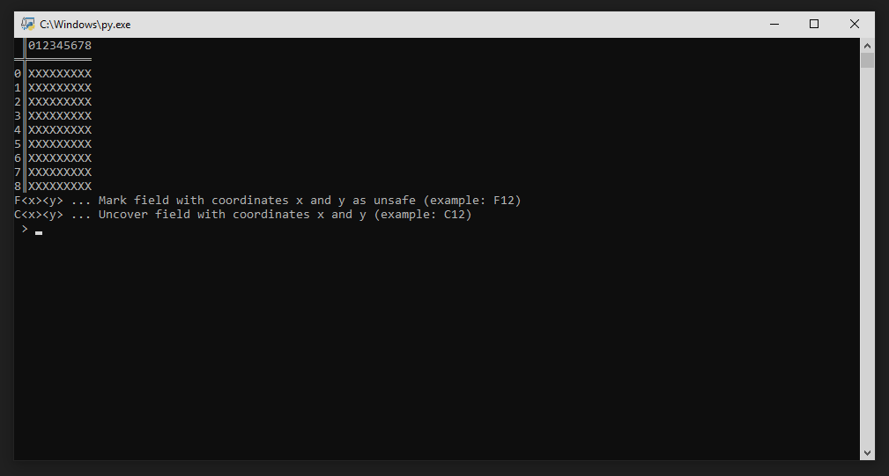
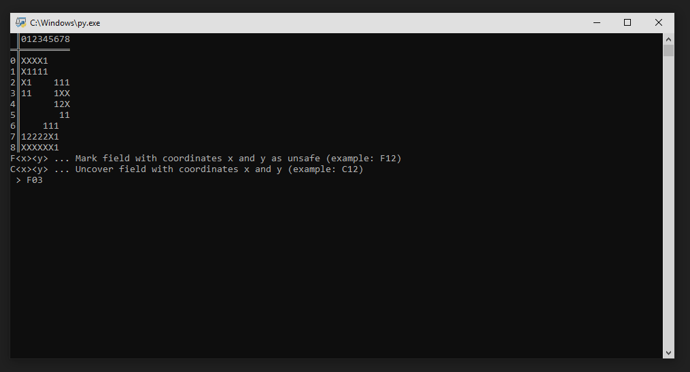
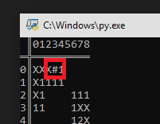

# Minesweeper-Python

*_Requires python packages random and os_*

First you are asked to initialize the gameboard. For that you will be asked for a height and width (both times a value between 1 and 9). The max size of the gameboard will look something like this:

Now you can enter "commands" to clear the board. There are two different commands. Both are three characters long.

F<x><y> ... Mark field with coordinates x and y as unsafe  
C<x><y> ... Uncover field with coordinates x and y

For example: _Mark field with x = 0 and y = 3 as unsafe_

